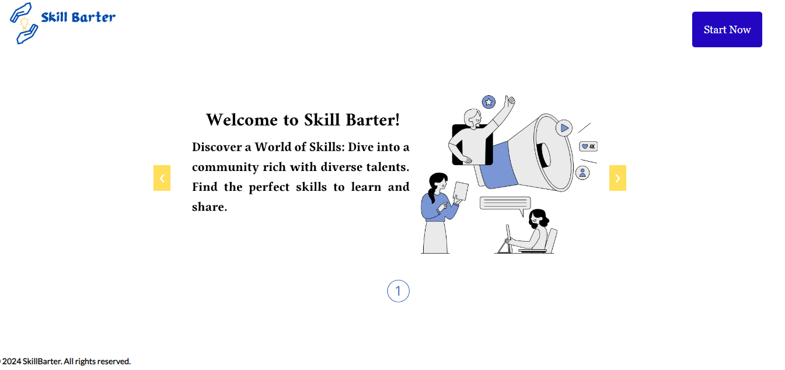

# SkillBarter

SkillBarter is a web application that allows users to barter their skills with others. Users can create profiles, list their skills, request barters, and manage ongoing barters. The application aims to foster a community where people can exchange skills and learn from each other.

## Table of Contents

- [Features](#features)
- [Technologies Used](#technologies-used)
- [API Endpoints](#api-endpoints)
- [Future Enhancements](#future-enhancements)

## Features

- User authentication (signup and signin)
- User profile creation and management
- Skill listing and searching
- create new barter
- Barter request and acceptance
- Ongoing barter management
- Chat functionality for bartering parties

## Technologies Used

- **Frontend**: HTML, CSS, JavaScript
- **Backend**: Python (Flask)
- **Database**: MySQL
- **Frameworks**: Flask for building RESTful APIs
- **Others**: SQLAlchemy, Jinja2, Gunicorn

## API Endpoints

- **`GET /`**: Home page
- **`GET /signup`**: Sign up page
- **`POST /signup`**: Handle user sign up
- **`GET /signin`**: Sign in page
- **`POST /signin`**: Handle user sign in
- **`GET /profile/<user_id>`**: User profile page
- **`GET /barter`**: List all barters
- **`POST /barter`**: Create a new barter
- **`GET /barter_details/<barter_id>`**: View barter details
- **`POST /barter_details/<barter_id>`**: Handle barter requests and acceptance
- **`GET /requests`**: Manage user requests and barters
- **`GET /logout`**: Log out user

## Future Enhancements

- Implement rating and review system for barters
- Add more advanced search and filter options
- Enhance the chat functionality with real-time updates
- Develop a mobile app version

## link:
- deployed project page : https://jisook13.tech/
- LinkedIn post: https://www.linkedin.com/posts/safafarah_skill-barter-revolutionizing-skill-exchange-activity-7215754553655201792-h1gM?utm_source=share&utm_medium=member_desktop
Happy skill bartering!

